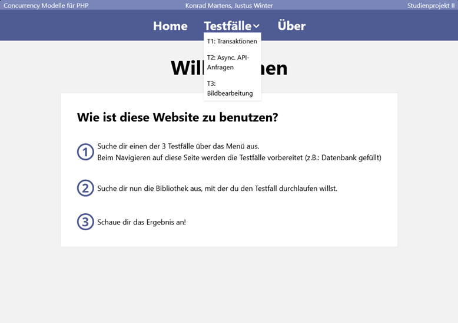

# Concurrency Modelle für PHP
Dieses Repository enthält den Quellcode für das Studienprojekt 2.

## Voraussetzungen
- [Git](https://git-scm.com/downloads)
- [Docker](https://docs.docker.com/get-docker/)

Für den Betrieb mit IIS wird außerdem benötigt:
- [Composer](https://getcomposer.org/Composer-Setup.exe)

## Installation
### Apache, nginx, Entwicklungsserver
#### Klone das Repository:
```shell
git clone https://github.com/paulpaulsen55/studienprojekt.git
cd studienprojekt
```

#### Baue und starte die Docker-Container:
```shell
docker-compose build
docker-compose up -d
```

Die verschiedenen Webserver sind unter folgenden Adressen zu erreichen:
- nginx: [http://localhost:8020](http://localhost:8020)
- apache: [http://localhost:8000](http://localhost:8000)
- dev: [http://localhost:8010](http://localhost:8010)

Darüber hinaus sind diese Ports belegt:
- webgrind: [http://localhost:8080](http://localhost:8080)
- phpMyAdmin: [http://localhost:8090](http://localhost:8090)

#### Stoppe die Docker-Container:
```shell
docker-compose down
```
---

### MS IIS

Für den IIS-Server muss eine manuelle Installation auf dem Host-Betriebssystem durchgeführt werden (getestet auf Windows 11 Pro 24H2 Betriebssystembuild 26100.3037):

1. PHP installieren: 
    - [PHP 8.3.16 ZTS 64-Bit](https://downloads.php.net/~windows/pecl/releases/parallel/1.2.6/php_parallel-1.2.6-8.3-ts-vs16-x64.zip) herunterladen und entpacken nach `C:\php`
    - `C:\php` zum PATH hinzufügen
    - `php.ini` anpassen (; vor Zeile entfernen):
        ```ini
        extension=pdo_mysql
        ```
    - ggfs. [MariaDB connector installieren](https://mariadb.com/downloads/connectors/connectors-data-access/odbc-connector/)
    - Falls bei Testfall 2 curl error 60 auftritt, [cacert.pem](https://curl.se/ca/cacert.pem) herunterladen und in `C:\php\extras\ssl\cacert.pem` speichern. In `php.ini` folgende Parameter ändern:
        ```ini
        curl.cainfo="C:\php\extras\ssl\cacert.pem"
        openssl.cafile="C:\php\extras\ssl\cacert.pem"
        ```
    - Testfall 3 benötigt ein Temporäres Verzeichnis für Uploads:
      - Verzeichnis erstellen: `C:\TEMP` und Rechte für Alle Benutzer geben
      - php.ini: `upload_tmp_dir = "C:\TEMP"`
2. Repository klonen und Abhänigkeiten installieren: 
    ```shell
    git clone https://github.com/paulpaulsen55/studienprojekt.git
    cd studienprojekt
    composer install
    ```
3. parallel extension installieren:
    - [parallel 1.2.5 für PHP 8.3.x 64-Bit](https://downloads.php.net/~windows/pecl/releases/parallel/1.2.5/php_parallel-1.2.5-8.3-ts-vs16-x64.zip) herunterladen und die `php_parallel.dll` in `C:\php\ext` speichern und `pthreadsVC3.dll` in `C:\php` legen
    - `php.ini` anpassen (hinzufügen):
        ```ini
        extension=parallel
        ```
4. IIS-Server & Module installieren:
    - Server und CGI-Modul installieren: 
    ```shell 
    dism /online /enable-feature /featurename:IIS-WebServerRole /all
    dism /online /enable-feature /featurename:IIS-CGI /all
    ```
    - [URL Rewrite Modul 64-Bit](https://download.microsoft.com/download/1/2/8/128E2E22-C1B9-44A4-BE2A-5859ED1D4592/rewrite_amd64_de-DE.msi) installieren
    - IIS starten (WIN+R inetmgr oder IIS suchen) 
    - FastCGI in IIS konfigurieren (siehe [Anleitung ab Kapitel 8](https://hostadvice.com/how-to/web-hosting/how-to-install-php-with-fastcgi-extension-on-iis-7-iis-8-server/#paragraph8))
    - Webseite in IIS hinzufügen (R-Klick Websites > Website hinzufügen...):
      - Sitename: `studienprojekt`
      - Pfad: `C:\Users\%USERNAME%\studienprojekt\src\public` (wo das repository geklont wurde)
      - Port: 8030
5. Xdebug & webgrind installieren:
   - [Xdebug DLL](https://xdebug.org/files/php_xdebug-3.1.1-8.3-vc15-x86_64.dll) herunterladen und in `C:\php\ext` speichern
   - `php.ini` anpassen (hinzufügen):
        ```ini
        zend_extension=xdebug
        xdebug.profiler_enable=1
        xdebug.mode=profile
        xdebug.profiler_enable_trigger=1
        xdebug.remote_enable=1
        xdebug.remote_autostart=1
        xdebug.remote_host=localhost
        xdebug.remote_port=9000
        xdebug.remote_handler=dbgp
        xdebug.use_compression=false
        xdebug.profiler_output_name=cachegrind.out.%p
        ```
    - [webgrind](https://github.com/jokkedk/webgrind) von GitHub klonen.
    - in den `webgrind` Ordner wechseln und `composer install` ausführen
    - webgrind starten mit `composer serve`
6. Datenbank starten (Docker):
    ```shell
    docker-compose up -d db
    ```
Die Webseite ist nun unter [http://localhost:8030](http://localhost:8030) erreichbar.

## Entwicklung
Das `src` Verzeichnis enthält den Quellcode der Anwendung. Der Ordner wird in den Container gemountet, sodass Änderungen direkt in der Anwendung sichtbar sind.

## Fehlerbehebung
Fehler beim Starten der Docker-Container können durch bereits laufende Prozesse auf den Ports verursacht werden. Diese müssen beendet werden, bevor die Container gestartet werden können. Bei anderen Problemen kann als letzte Lösung ein harter Reset durchgeführt werden (alternativ die betroffenen Container stoppen und entfernen):
```shell
docker system prune -a --volumes
```
Auch die Zeilenumbrüche können Probleme verursachen falls auf Windows entwickelt wird. Es wird empfohlen, die Dateien im Unix-Format zu speichern (LF).
Bei veränderter Konfiguration unter Windows sollte der IIS neu gestartet werden. 
```shell
    iisreset /restart
```

## Verwendung
Auf der Seite angekommen ist eine kurze Anleitung zu sehen und ein ausklappbares Menü, welches zur Navigation der Testfälle benutzt werden kann.

Für jeden Testfall werden die Daten zurückgesetzt, wenn man über das Menü zur Test-Startseite navigiert. Bei den Tests kann dann über eine Schaltfläche die Bibliothek parallel oder Fibers zur Durchführung des Tests ausgewählt werden.

Nach erfolgreicher Ausführung des Tests wird die nativ gemessene Ausführungszeit direkt auf der Seite angezeigt.
Unter http://localhost:8081 kann auf webgrind zugegriffen werden, welches die von Xdebug generierten Cachegrind-Dateien anzeigt. Mit einem Klick auf „update“ wird die Anzeige generiert. Über den Button „Show Call Graph“ kann der Aufrufgraph generiert werden.


## Weiteres zu Webservern
Die Anwendung, welche das SlimPHP Framework benutzt, kann mit verschiedensten Webservern betrieben werden ([siehe guide](https://www.slimframework.com/docs/v4/start/web-servers.html)).
